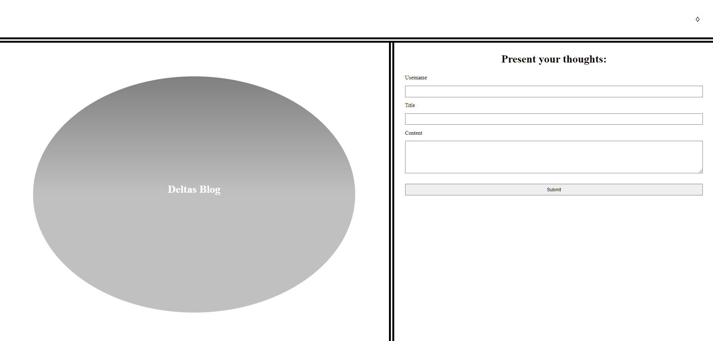
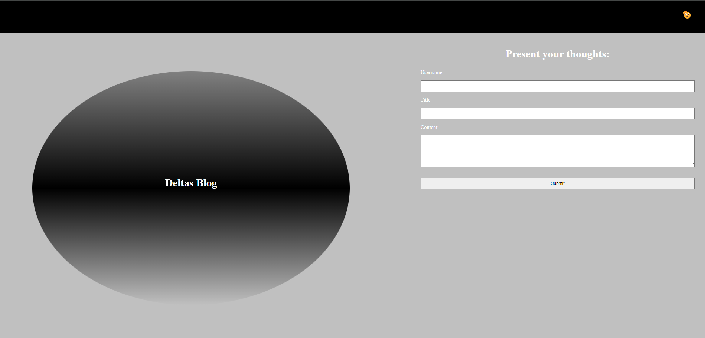
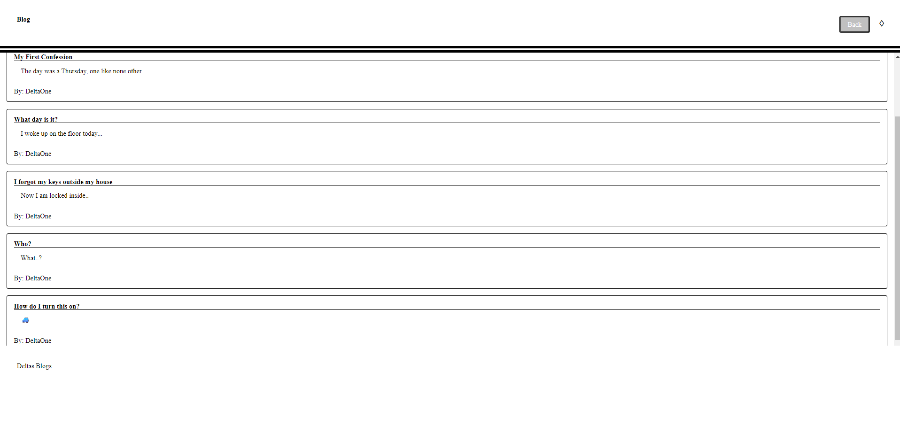
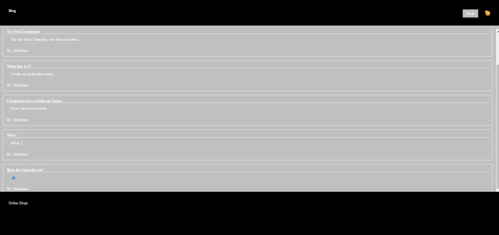

# DELTAS BLOG

## Description

This is DELTAS BLOG. To share my thoughts, or for anyone else to do so too.

## Features

- Users can log blogs by entering their username, a title, and the content of their post.

- Entries:

- Theme Toggle:

## Technologies Used

- JavaScript
- Local Storage
- CSS
- HTML

## Usage

- Here you can share your thoughts, or absence thereof.

## Contributing

- The class speedruns were intrumental to the completion of this project. Special thanks to our instructor Andrew.

## License

MIT License
